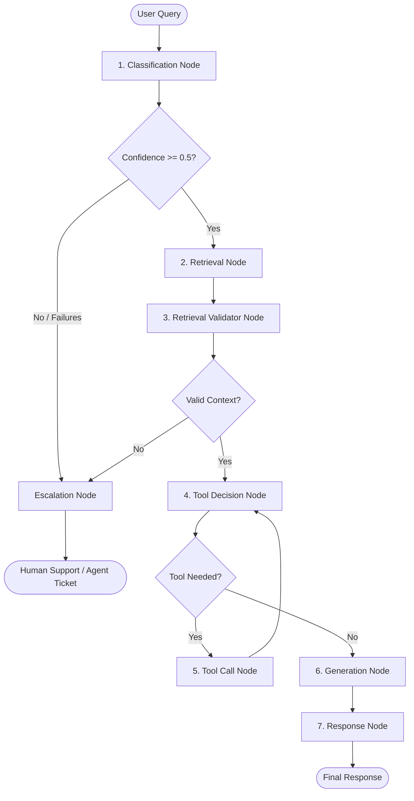

# Support Orchestrator

An intelligent customer support agent orchestration system built with Node.js, TypeScript, Express, Redis, Qdrant, and Ollama (running local LLMs). 

The system routes, validates, retrieves, and processes user queries through a multi-node pipeline, deciding dynamically when to answer using local documentation (RAG), when to call operational APIs/tools, and when to escalate to human support.

---

## 🛠️ Tech Stack

- **Runtime**: Node.js with TypeScript (`tsx` for direct execution)
- **Local LLM Orchestrator**: [Ollama](https://ollama.com/) running `llama3.1:latest`
- **Embedding Model**: `nomic-embed-text`
- **Vector Database**: [Qdrant](https://qdrant.tech/) (running locally at port `6333`)
- **Key-Value Store / Caching**: [Redis](https://redis.io/) (for session & conversation history)
- **Web Framework**: Express.js
- **Validation**: Zod (for strict JSON schema validation of LLM outputs)

---

## 🏗️ Pipeline Architecture

The orchestration engine processes every incoming query through a structured sequence of stateful nodes:



### Node Descriptions

1. **Classification Node** ([classifier.ts](file:///Users/ayush/Orchestrator/support-orchestrator/src/nodes/classifier.ts)): 
   Uses `llama3.1` to classify the query's intent (e.g., `billing`, `shipping`, `after_sales`, `technical`, `account`, `miscellaneous`), sentiment (e.g., `positive`, `neutral`, `negative`), and computes a confidence score. If LLM output fails schema validation, it retries up to 2 times before auto-escalating.
2. **Router** ([router.ts](file:///Users/ayush/Orchestrator/support-orchestrator/src/router.ts)):
   Determines the next step. If confidence is below `0.5`, it routes to the Escalation Node. Otherwise, it routes to Retrieval.
3. **Retrieval Node** ([retrieval.ts](file:///Users/ayush/Orchestrator/support-orchestrator/src/nodes/retrieval.ts)):
   Generates a vector embedding for the query using `nomic-embed-text` and retrieves the top 3 most relevant documents from the Qdrant `support-docs` collection.
4. **Retrieval Validator Node** ([retrievalValidator.ts](file:///Users/ayush/Orchestrator/support-orchestrator/src/nodes/retrievalValidator.ts)):
   Validates if the retrieved documents actually contain sufficient information to address the query. If no relevant docs match (score > `0.6`), it bypasses LLM and routes straight to Escalation.
5. **Tool Decision Node** ([toolDecide.ts](file:///Users/ayush/Orchestrator/support-orchestrator/src/nodes/toolDecide.ts)):
   Determines if the request requires real-time operations (e.g. order tracking, details, refunds, customer info) and supports sequential tool-chaining (e.g., automatically resolving `orderId` via `getCustomerDetails` before calling `getOrderDetails`).
6. **Tool Call Node** ([toolCall.ts](file:///Users/ayush/Orchestrator/support-orchestrator/src/nodes/toolCall.ts)):
   Selects the correct tool (e.g., `getCustomerDetails`, `getOrderDetails`, `getOrderStatus`, `issueRefund`, `updateAddress`) and maps LLM-extracted arguments to execute backend queries.
7. **Generation Node** ([generation.ts](file:///Users/ayush/Orchestrator/support-orchestrator/src/nodes/generation.ts)):
   Combines conversation history (from Redis), retrieved document context, and tool execution results to generate a concise, professional response.
8. **Response Node** ([response.ts](file:///Users/ayush/Orchestrator/support-orchestrator/src/nodes/response.ts)):
   Prepares the final response state to return to the caller.
9. **Escalation Node** ([escalation.ts](file:///Users/ayush/Orchestrator/support-orchestrator/src/nodes/escalation.ts)):
   Gracefully flags the ticket for human intervention when the LLM is unconfident, validation fails, or appropriate resources are missing.

---

## 🚦 Prerequisites

Ensure you have the following running on your local machine:

1. **Redis**: Running on `localhost:6379`
   ```bash
   # Run via Docker
   docker run -d --name support-redis -p 6379:6379 redis
   ```
2. **Qdrant**: Running on `localhost:6333`
   ```bash
   # Run via Docker
   docker run -d --name support-qdrant -p 6333:6333 -p 6334:6334 qdrant/qdrant
   ```
3. **Ollama**: Running on `localhost:11434`
   - Download and install [Ollama](https://ollama.com/).
   - Pull the required models:
     ```bash
     ollama pull llama3.1
     ollama pull nomic-embed-text
     ```

---

## 🚀 Getting Started

### 1. Install Dependencies
Navigate to the project folder and install dependencies:
```bash
npm install
```

### 2. Set Up Qdrant Collection
Create the required `support-docs` vector collection (configured for 768-dimensional cosine similarity vectors):
```bash
npx tsx src/setupQdrant.ts
```

### 3. Index Knowledge Base Documents
Index the local markdown-based company policies ([docs.ts](file:///Users/ayush/Orchestrator/support-orchestrator/src/data/docs.ts)) into Qdrant:
```bash
npx tsx src/indexDocs.ts
```

### 4. Start the Server
Run the Express API server (runs on port `6969`):
```bash
npx tsx src/server.ts
```

---

## 📡 API Endpoints

### `POST /query`
Submits a query to the support orchestrator. Conversations are tracked and stored in Redis using the `sessionId`.

#### Request Headers
`Content-Type: application/json`

#### Request Body
```json
{
  "query": "Where is my order ORD123?",
  "sessionId": "session_user_99"
}
```

#### Example Response (Successful Tool-Chained Call)
```json
{
  "query": "Can you tell the details of my order? My Customer ID is CUST123",
  "currentNode": "response",
  "retryCount": 0,
  "messages": [],
  "observations": [
    {
      "toolName": "getCustomerDetails",
      "input": { "customerId": "CUST123" },
      "output": {
        "name": "Ayush Guleria",
        "email": "ayush@gmail.com",
        "orderId": "ORD456"
      }
    },
    {
      "toolName": "getOrderDetails",
      "input": { "orderId": "ORD456" },
      "output": {
        "items": "mobile",
        "quantity": 3,
        "price": 10000
      }
    }
  ],
  "intent": "account",
  "sentiment": "neutral",
  "confidence": 0.85,
  "retrievedDocs": [
    {
      "score": 0.56,
      "content": "..."
    }
  ],
  "retrievalValid": true,
  "retrievalConfidence": 0.95,
  "toolNeeded": false,
  "toolResponse": {
    "items": "mobile",
    "quantity": 3,
    "price": 10000
  },
  "finalResponse": "Based on our records, your customer name is Ayush Guleria. Your recent order details (Order ID: ORD456) include item 'mobile', quantity 3, with a total price of $10,000."
}
```

#### Example Response (Escalated Query)
```json
{
  "query": "Can I get a discount because the moon is blue?",
  "currentNode": "escalation",
  "retryCount": 0,
  "messages": [],
  "intent": "miscelleneous",
  "sentiment": "neutral",
  "confidence": 0.2,
  "escalationNeeded": true,
  "finalResponse": "You have been escalated to human support agent"
}
```

---

## 📂 Project Structure

```
support-orchestrator/
├── src/
│   ├── config/
│   │   └── redis.ts                     # Redis connection settings
│   ├── data/
│   │   └── docs.ts                      # Local knowledge base documentation
│   ├── nodes/
│   │   ├── classifier.ts                # Intent & sentiment classification node
│   │   ├── escalation.ts                # Human agent escalation node
│   │   ├── generation.ts                # LLM response generation node
│   │   ├── response.ts                  # Final response formatter node
│   │   ├── retrieval.ts                 # Document retrieval (Qdrant search) node
│   │   ├── retrievalValidator.ts        # Retrieved document relevance checker node
│   │   ├── toolCall.ts                  # Target tool execution node
│   │   └── toolDecide.ts                # Tool vs. Policy selector node
│   ├── tools/
│   │   └── orderTools.ts                # Hardcoded/mock APIs for orders/refunds
│   ├── customer-sentiment-classifier.ts # Standalone classification example script
│   ├── embed.ts                         # Embedding generation helper (nomic-embed-text)
│   ├── indexDocs.ts                     # Document indexing script
│   ├── qdrant.ts                        # Qdrant client connection
│   ├── router.ts                        # Pipeline routing helper functions
│   ├── runPipeline.ts                   # Core orchestrator pipeline manager
│   ├── server.ts                        # Express API server setup
│   ├── setupQdrant.ts                   # Vector DB collection setup script
│   └── state.ts                         # SupportState type definition
├── package.json
└── README.md
```